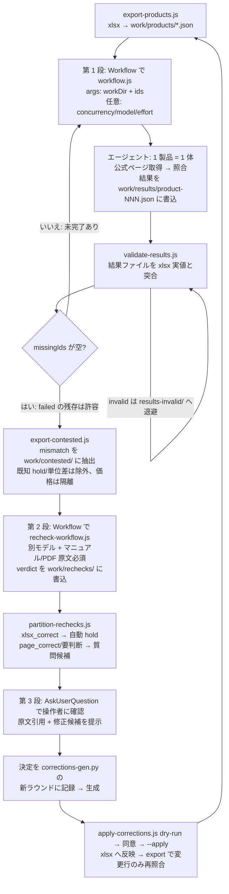

# tools/verify — 製品スペック自動照合パイプライン

`data/audio_interfaces.xlsx` の各機種 (Measurement Reports 列を除く全列) を Product Page URL の公式ページと照合し、相違をレポートする。2026-07 の初回実施で得た教訓 (途中中断・一時ファイル消失によるデータ汚染・ボット保護による未照合) を反映した再設計版。

## 全体フロー

3 段構成: 第 1 段 = 全項目スキャン (安価なモデルで広く)、第 2 段 = 相違のみ精査 (別モデル + マニュアル原文必須で偽陽性を排除)、第 3 段 = 自動仕分けと操作者への質問解決。



初回のような大規模サイクル (相違が数百件) では、第 2 段の代わりに `propose-corrections.js` + `build-report.js` の一括レビュー (相違表 = 機種/列/修正候補/変更理由/変更前、進捗は work/review-state.json) も使える。どちらの経路でも、確定した判断は corrections-gen.py に記録し apply-corrections.js で反映する点は同じ。

## 中断耐性の設計 (リソース不足・利用制限対策)

- **チェックポイント = 結果ファイル**: 各エージェントが照合完了時に `work/results/product-NNN.json` を自分で書き込む。ワークフロー本体やセッションが死んでも完了分はファイルとして残る。ワークフローの戻り値は進捗の要約のみで、データの正本はファイル側。
- **消えない作業領域**: `work/` はリポジトリ内 (git 管理外)。/tmp のセッション別 scratchpad はセッション再起動で消えるため使わない (初回実施で 273 ファイル消失 → エージェントが勝手に xlsx から行を再構成 → 1 行ズレの汚染が発生した)。
- **復旧はキャッシュ非依存**: 再開時は `validate-results.js` が結果ファイルの有無と健全性から `nextIds` を算出し、その ids だけを `workflow.js` に渡して再実行する。Workflow ツールの `resumeFromRunId` キャッシュが使えない状況 (別セッション・スクリプト変更後) でも復旧できる。
- **既定は直列実行**: 中断しても失うのは実行中の 1 件のみ。`args.concurrency` で並列化できる (ワーカープール方式。中断で失うのは実行中の最大 concurrency 件で、いずれも validate → nextIds で復旧する)。同時実行の上限は Workflow 実行環境の枠 = min(16, CPU コア − 2)。
- **サーキットブレーカー**: エージェントが完了順で連続 `maxConsecFail` 回 (既定 5) 失敗したら未着手分を打ち切る。利用制限中に残り全件を無駄に失敗させない。制限解除後に validate → 再実行で続きから進む。
- **モデル/エフォート指定**: `args.model` / `args.effort` でエージェント単位のモデル・エフォートを指定できる (省略時はセッション継承)。照合は機械的タスクのため下位モデルでもよい。汚染は validate が検出するが、相違の見落とし (false negative) は検出できない点に留意。

## 未照合 (failed) を減らす取得ラダー

エージェントは次の順で取得を試み、試行ログを結果の `attempts` に残す:

1. WebFetch
2. `curl -sL --compressed` + ブラウザ User-Agent
3. headless Chrome (`--headless=new --dump-dom --virtual-time-budget=15000` + UA 指定) — Cloudflare 等の JS チャレンジ対策
4. 404/転送時は同一公式ドメインの sitemap.xml・404 ページ内リンクから正ページを探索 (`wrong_page` として正 URL を記録)
5. 同一公式サイトの Specifications ページ・データシート/マニュアル PDF (`pdftotext -layout` で解析)
6. 記載 URL のドメイン廃止時に限り、同一ブランド所有の公式ドメイン (例: focusritepro.com → focusrite.com)。小売・レビューサイトは禁止

Cloudflare Turnstile 等で全手段が失敗するサイトは `failed` として残し、レポートで「未照合 (データ誤りではない)」と明示する。

## 汚染防止と健全性検証

- エージェント規則: **入力ファイルが読めない場合は照合せず `failed` で終了** (xlsx や他ソースからの行の再構成を禁止)。`brand` / `model` に入力ファイルの値を写す (由来の証明)。
- `validate-results.js` が全結果ファイルを xlsx 実値と突合:
  - brand/model の写しが該当行と一致するか (別行照合＝汚染の検出)
  - mismatch の `xlsx_value` 引用が該当行の実値と矛盾しないか
  - 入力欠損・再構成をうかがわせる文言 (警告)
- 不正ファイルは `work/results-invalid/` へ退避され自動的に未完了扱いとなり、次回実行で再照合される。

## 運用手順

```bash
# 1. xlsx から入力を生成 (再実行しても安全。xlsx 更新時は必ず再実行。
#    前回 export から内容が変わった行の旧結果は自動で results-retired/ へ退避され再照合対象になる)
node tools/verify/export-products.js

# 2. Claude Code で Workflow を起動 (ids は初回は全件、再開時は state.json の nextIds)
#    Workflow({ scriptPath: "<repo>/tools/verify/workflow.js",
#               args: { workDir: "<repo>/tools/verify/work", ids: [...],
#                       concurrency: 8, model: "sonnet", effort: "high" } })
#    concurrency / model / effort は任意 (省略時: 直列 / セッション継承 / セッション継承)

# 3. 健全性検証と未完了 ids の算出
node tools/verify/validate-results.js

# 4. nextIds (= missingIds) が空になるまで 2-3 を繰り返す。
#    failed (ボット保護等) は残ってよい: nextIds には入らず、レポートに「未照合」と明示される。
#    failed / partial に再挑戦したいときだけ --retry-failed / --include-partial を付ける
#    (対象の旧結果は results-retired/ へ退避され nextIds に載る)

# 5. 第 2 段: 相違のみ精査して偽陽性を排除する (標準経路)
node tools/verify/export-contested.js             # mismatch を work/contested/ に抽出。
#    既知 hold (work/known-holds.json) と単位差のみの相違は自動除外、
#    Reference Price の相違は work/price-diffs.json に隔離 (レポートの一括判断セクションへ)
#    → Workflow({ scriptPath: "<repo>/tools/verify/recheck-workflow.js",
#                 args: { workDir: "<repo>/tools/verify/work",
#                         ids: <work/contested-index.json の配列>,
#                         concurrency: 2, model: "<第 1 段と別モデル>", effort: "high" } })
#    第 2 段の並列度は 2 が上限 (スクリプト側で固定)。マニュアル PDF 解析 + headless Chrome の
#    メモリ負荷が高く、並列 8 で Claude Code プロセスごと落ち、並列 4 でも高負荷だった (2026-07-12)
#    エージェントはマニュアル/データシート PDF の参照が必須で、争点列ごとに
#    verdict (xlsx_correct / page_correct / judgement_required) + 原文引用 + 修正候補を返す

# 6. 第 3 段: 仕分けと質問解決
node tools/verify/partition-rechecks.js           # → work/corrections-recheck.json + 質問下書き
#    xlsx_correct は自動 hold (質問不要)。page_correct / judgement_required だけを
#    機種単位で AskUserQuestion (原文引用 + 修正候補 + 修正適用/変更なし) にかけ、
#    操作者決定を work/corrections-gen.py の新ラウンドに記録して corrections-round*.json を生成する。
#    恒久的な「変更不要」は gen の KNOWN_HOLDS にも追加する (次サイクルから自動除外される)

# 7. xlsx への反映 (要・操作者の同意) と整合確認
node tools/verify/apply-corrections.js tools/verify/work/corrections-round<N>.json          # dry-run
node tools/verify/apply-corrections.js tools/verify/work/corrections-round<N>.json --apply  # 同意後
node tools/verify/export-products.js              # 変更行の旧照合結果が自動退避 → 該当行だけ再照合して整合を確認
```

事前 lint (任意): `node tools/verify/lint-columns.js` で xlsx 列間の矛盾 (S/PDIF 光 > 光ポート数、ADAT ch が 8 の倍数でない等) をエージェントなしで検出できる。

### 大規模サイクル向けの一括レビュー経路 (初回など相違が数百件のとき)

```bash
# 5'. 修正候補の作成 (高確度の相違がある場合はレポート生成より先に行う)
node tools/verify/propose-corrections.js          # --all で low も含める
#    → work/corrections-proposal.json の proposed (ページ記載の生テキスト) を xlsx セル書式の
#      「修正後セル値」に編集し、work/corrections-edited.json として保存する:
#      [{ idx, brand, model, column, confidence?, current, proposed, note?, hold?, unreviewed?, missing? }]
#      - proposed: 修正後セル値。"" は空欄化 (非搭載・該当なし・未公表は 0 や No ではなく空欄の慣行)
#      - note: レポート表示用の補足 / hold: 反映を保留する理由 (apply でスキップされる)
#      - unreviewed: 操作者の確認待ち (apply でスキップ。review-state の境界更新で外れる)
#      - missing: 空欄追記由来の印 (レポートの「空欄追記の候補」セクションに描画される)
#      - 相違由来でない一括修正 (書式統一・行統合の反映・空欄追記など) も同スキーマで追加できる
#        (confidence キーが一致しないためレポートの相違表には出ず、apply にのみ効く)
#    操作者レビューの進捗は work/review-state.json
#    ({ highReviewedUntilIdx, lowReviewedUntilIdx, missingReviewedUntilIdx })。
#    build-report.js は到達済み範囲の相違行を非表示にし、未確認分だけを表示する。
#    missing_in_xlsx (空欄追記) のうち機械変換できない項目は work/missing-pending.json に保留として
#    出力し、build-report.js は保留分のみを「空欄」セクションに描画する

# 6'. レポート生成 (リポジトリ直下 product-page-verification-report.md。git 管理外で、
#    更新のたびに再生成・上書きし、照合サイクル完了後に削除する)
#    相違表の列構成 (変更後の値を左に置く) と表示規則は build-report.js の生成に従う
#    (運用の詳細は .claude/skills/verify-products/SKILL.md の「レポート」節)。
#    既知 hold (known-holds.json) 一致分は自動で除外され、価格の相違は独立セクションに分離される
node tools/verify/build-report.js

# 7'. xlsx への反映は標準経路の手順 7 と同じ (corrections-edited.json を渡す)
```

利用制限で打ち切られた場合も手順は同じ: 制限解除後に validate → nextIds で再起動するだけでよい。

0 から (結果なしの状態から) 完全実行する場合は、既存の `work/results/` を `work/results-archive-<日付>/` に退避してから手順 1 に入る (validate が全件を missingIds として算出する)。

## 結果ファイルのスキーマ (work/results/product-NNN.json)

| キー | 内容 |
|---|---|
| brand / model | 入力ファイルの Brand / Model の写し (由来検証用) |
| fetch_status | ok / partial / wrong_page / failed |
| attempts | 取得試行ログ ("方法: URL → 結果" の配列) |
| sources | 実際に照合へ使ったページ URL |
| mismatches | { column, xlsx_value, page_value, confidence: high/low, evidence } |
| not_stated | ページから確認できなかった列名 |
| missing_in_xlsx | ページに公称値があるが xlsx が空欄の項目 (最大 6 件) |
| notes | 照合ソースと留意点 (3 文以内) |

## 精査結果のスキーマ (work/rechecks/product-NNN.json)

| キー | 内容 |
|---|---|
| brand / model | contested 入力の写し (由来検証用) |
| fetch_status | ok / partial / failed |
| attempts / sources / notes | 結果ファイルと同じ |
| verdicts | { column, verdict: xlsx_correct/page_correct/judgement_required, reason: page_omission/marketing_simplification/unit_difference/counting_convention/page_error/xlsx_error/ambiguous, quote (原文引用 + URL), proposed?, note? } |

## ディレクトリ構成

```
tools/verify/
├── README.md              ← 本書
├── lib.js                 ← node スクリプト共通ヘルパー (STATUSES/plain/readHeaders/scanResults 等。Workflow スクリプト 2 本は import 不可のため対象外)
├── export-products.js     ← xlsx → work/products/*.json
├── workflow.js            ← 第 1 段: 全項目スキャン (Workflow ツール用。node では実行しない)
├── validate-results.js    ← 健全性検証・nextIds 算出 (work/state.json)
├── export-contested.js    ← 第 2 段入力: mismatch を work/contested/ に抽出 (既知 hold/単位差除外、価格隔離)
├── recheck-workflow.js    ← 第 2 段: 争点の精査 (Workflow ツール用。node では実行しない)
├── partition-rechecks.js  ← 第 3 段入力: verdict 仕分け → work/corrections-recheck.json + 質問下書き
├── lint-columns.js        ← 列間整合の事前 lint (エージェント不要)
├── build-report.js        ← レポート生成 (既知 hold を自動除外、価格は独立セクション、削除予定/削除済みは removals.json の保存名で照合し idx ずれの影響を受けない)
├── propose-corrections.js ← mismatch から xlsx 修正案を生成 (大規模サイクルの一括レビュー用)
├── apply-corrections.js   ← 同意済み修正リストを xlsx へ反映 (既定 dry-run)
└── work/                  ← git 管理外の作業領域
    ├── products/          ← 照合入力 (製品別 JSON)
    ├── results/           ← 照合結果 (チェックポイント正本)
    ├── results-invalid/   ← 検証で弾かれた結果の退避先
    ├── results-retired/   ← 再試行・xlsx 更新で置き換え対象になった旧結果の退避先
    ├── contested/         ← 第 2 段入力 (争点のある機種のみ。export-contested が毎回作り直す)
    ├── rechecks/          ← 第 2 段結果 (チェックポイント)
    ├── contested-index.json      ← 第 2 段の対象 ids
    ├── price-diffs.json          ← 隔離された参考価格の相違 (レポートの一括判断セクション)
    ├── known-holds.json          ← 既知 hold の恒久 suppression (正本は corrections-gen.py の KNOWN_HOLDS)
    ├── corrections-recheck.json  ← 第 3 段の仕分け結果 (自動 hold + unreviewed 修正候補。中間生成物)
    ├── rows-full.json     ← xlsx 全行 (idx 0 = シート 2 行目)
    ├── state.json         ← validate の集計・nextIds
    ├── corrections-proposal.json ← propose-corrections.js の修正案 (ページ記載の生テキスト)
    ├── corrections-gen.py        ← 修正候補と操作者判断 (FIX/HOLD/KNOWN_HOLDS/ラウンド等) の蓄積スクリプト (正本)
    ├── corrections-edited.json   ← corrections-gen.py の生成物 (レポート差込 + apply 入力。直接編集しない)
    ├── corrections-round*.json   ← 各ラウンドの操作者決定 (gen の生成物。apply 入力)
    ├── review-state.json         ← 操作者レビューの到達 idx (到達済み範囲はレポートから省く)
    └── missing-pending.json      ← 空欄追記のうち機械変換できず操作者判断待ちの項目
```
